# ПРАКТИЧЕСКАЯ РАБОТА №1. Основы Git: От репозитория до первого коммита
🔝 [Все практические работы](../README.md)  
🔜 [Язык Markdown: Оформление документации на GitHub](../PR2/PR2.md)
***

## Содержание

🔍 [Теория](#Теория)  
💡 [Полезные ссылки](#Полезные-ссылки)  
⚔️ [Учебная задача](#Учебная-задача)  
📋 [Задания](#Задания)  
🚩 [Контрольные вопросы](#Контрольные-вопросы)

*** 

## Теория

Представьте, что вы работаете над кодом, рефератом или дизайном игры (Game Design Document). Вы сохраняете первый файл `GDD.docx`. Затем вносите изменения и сохраняете его как `GDD_v2.docx`. Потом появляется новая идея и новый файл — `GDD_FINAL.docx`, а затем и `GDD_FINAL2.docx`. Вскоре папка превращается в хаос, и невозможно понять, какая версия является последней или в какой из них было внесено ключевое изменение.

**Система контроля версий (Version Control System — VCS)** — это инструмент, который решает эту проблему . Он записывает изменения в файлах, позволяя в любой момент вернуться к любой предыдущей версии проекта. Git — самая популярная распределенная VCS в мире.

**GitHub** — это веб-платформа для хостинга проектов с использованием Git. Это своего рода «социальная сеть для разработчиков», где можно хранить код, совместно работать над ним и делиться им с миром.

**Репозиторий (Repository)** — это хранилище вашего проекта. Он содержит все файлы проекта и всю историю их изменений. Репозиторий может быть локальным (на вашем компьютере) или удаленным (на сервере, например, на GitHub). В нашем случае мы работаем с удаленным репозиторием на GitHub.

**Коммит (Commit)** — это основная единица истории проекта. Коммит представляет собой снимок (snapshot) состояния всех файлов в репозитории на определенный момент времени. Каждый *коммит* имеет:
* **Уникальный идентификатор (хеш)**
* **Автора**
* **Дату**
* **Сообщение (Commit message)** — краткое и понятное описание того, что было изменено и почему. Например: "Добавлен класс главного героя", "Исправлена ошибка с столкновениями", "Обновлен дизайн меню".

**Ветка (Branch)** — это "параллельная вселенная" вашего проекта. По умолчанию всегда существует главная ветка, которая обычно называется `main`. Она содержит стабильную, рабочую версию проекта.  

_Зачем нужны ветки?_ Представьте, что вам нужно добавить в игру нового босса. Если вы будете работать прямо в `main`, то можете случайно сломать рабочую версию. Вместо этого вы создаете новую ветку, например, `feature/new-boss`. В этой ветке вы можете спокойно экспериментировать, не затрагивая `main`. Когда работа над боссом будет завершена и протестирована, вы сможете "влить" изменения обратно в главную ветку.

**Слияние (Merge)** — это процесс объединения изменений из одной ветки в другую. Например, когда вы завершили работу над новой функцией в ветке `feature/new-weapon`, вы сливаете ее с веткой `main`, чтобы эта функция стала частью основной игры.

## Полезные ссылки

1. [Официальная документация GitHub](https://docs.github.com/ru)
2. [Интерактивные курсы от GitHub прямо в вашем браузере](https://skills.github.com/)
3. [Официальная документация Git (книга Pro Git) ](https://git-scm.com/book/ru/v2)


## Учебная задача

Первым делом перейдите на [github.com]() и зарегистрируйтесь.  

>Если у вас уже есть учетная запись, то регистрировать новую учётку необязательно

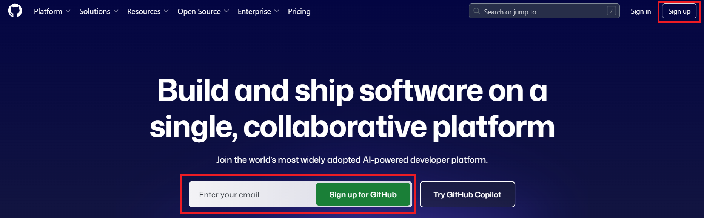


Создайте новый репозиторий, нажав `New` 

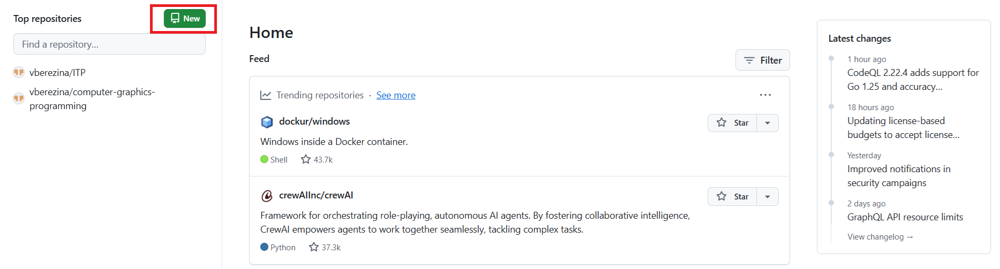

>Под поисковой строкой `Find a repository...` находится список всех доступных на этой учетке репозиториев.

Чтобы создать репозиторий нужно указать общую информацию и базовые настройки.

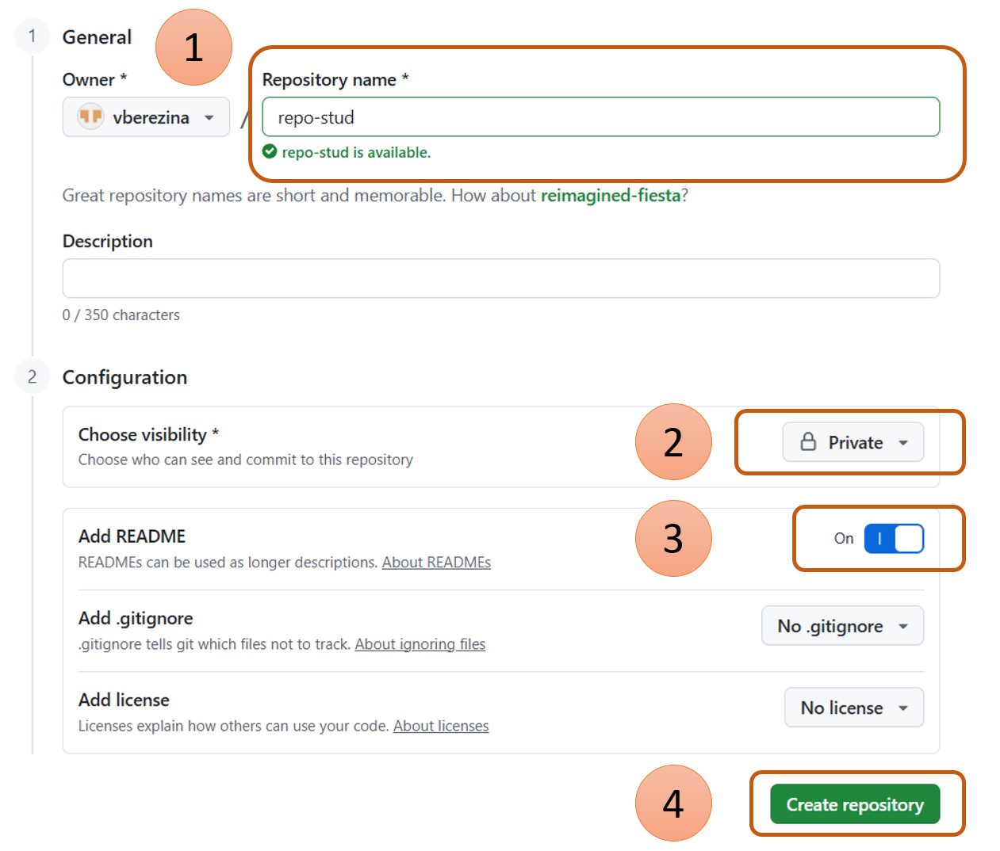

1. Название репозитория.
> _Если название состоит из нескольких слов, то обычно используют дефис между ними._

2. Настройки приватности.
> **public** — если хотите сделать репозиторий общедоступным.  
**private** — если пока что не хотите им ни с кем делиться.

3. Добавить файл README.
> Это файл с возможным описанием репозитория. Или навигацией. Или ссылками.  
README отображается на главной странице репозитория.

4. Создать репозиторий.  
> Если все обязательные поля заполнены правильно, то кнопка будет активна.
  
Если всё прошло успешно, то вы увидите что-то похожее:

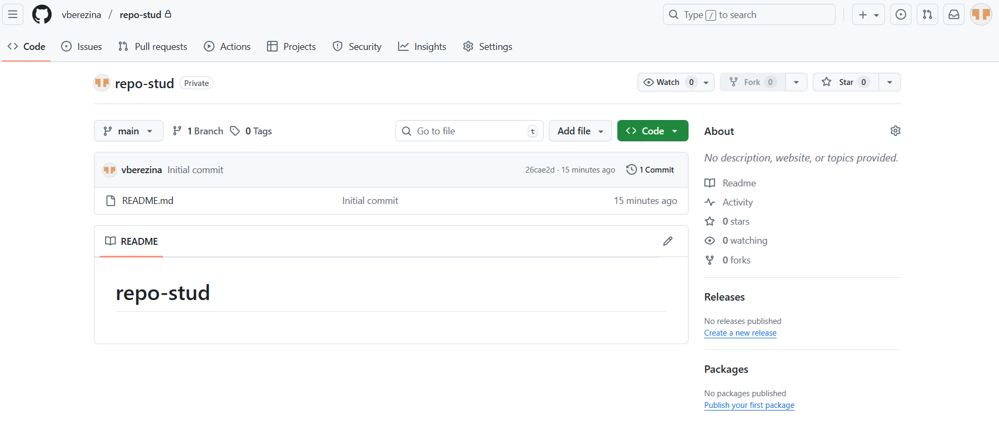

Теперь добавим новый файл `Add file > Create new file`

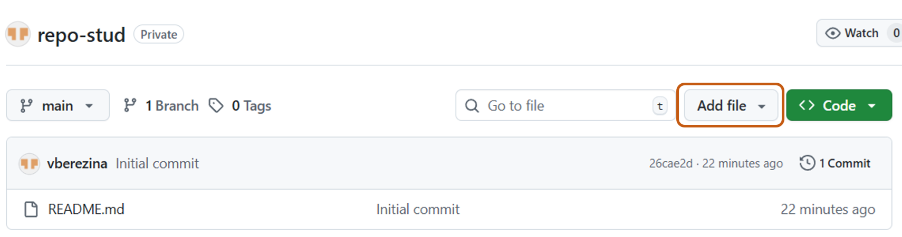

В качестве примера будем использовать разработку простой игры и первый файл будет с концептом игры.

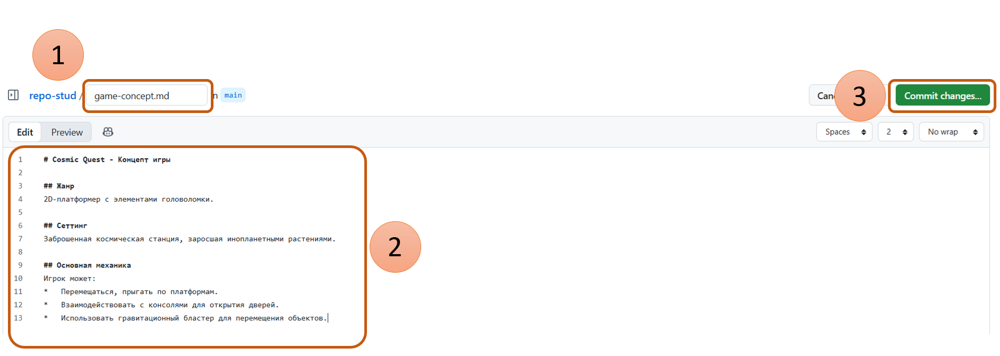

1. Название файла.
> `.md` — это расширение для файла `Markdown`. Этот язык разметки текста более подробно будет рассмотрен в следующей работе.  

2. Содержание файла.
> `#` — заголовок первого уровня  
`##` — заголовок второго уровня

Если переключиться на `Preview`, то можно увидеть размеченный текст.

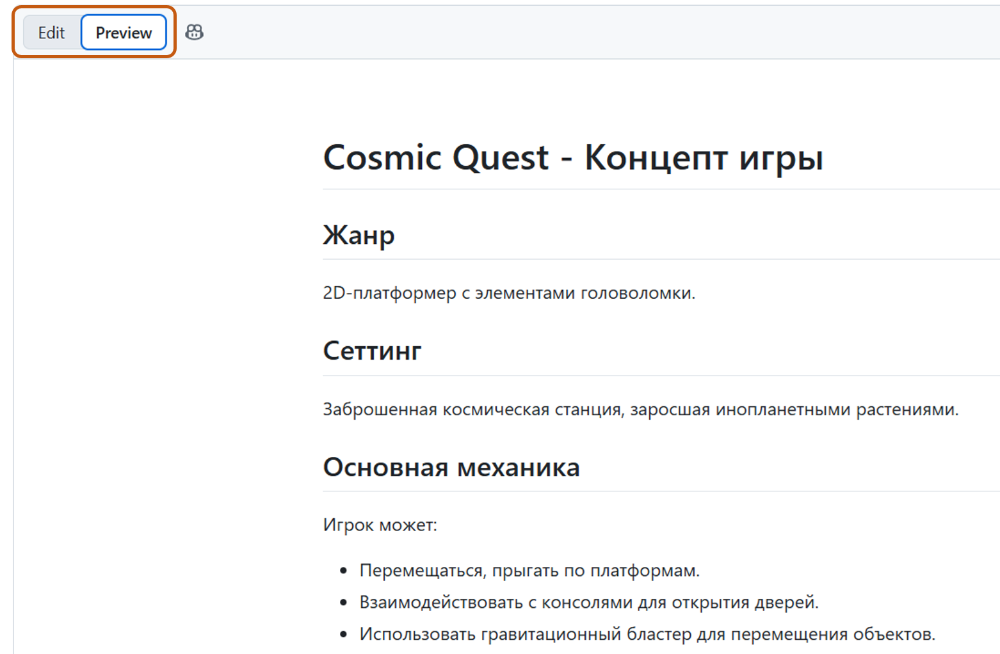

>`Preview` доступно не для всех файлов. 

3. Зафиксировать изменения.
> Можно сказать, что это способ сохранить файл.

Нажмите на `Commit Changes` и появится окно с подробностями коммита:

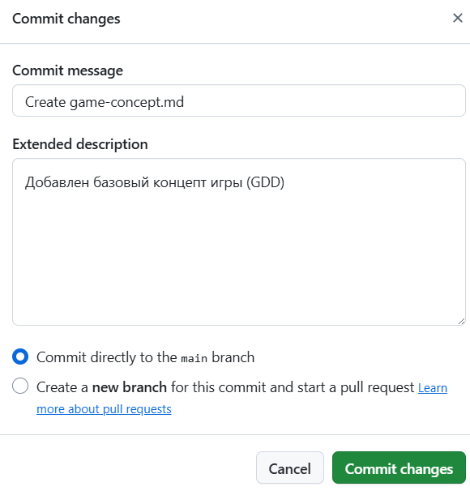

`Commit message` — название коммита. Обычно в этом поле кратко указывают какие изменения были внесены.
>В данном случае это первый коммит, поэтому сообщение и указывает на то, что создаётся файл с каким-то названием.

`Extended description` — более подробное описание коммита.

> _Можно оставить пустым._ Но если изменений было много, то рекомендуется указывать их в этом поле.

`Commit directly to the main branch` — указывает на то, что коммит будет сделан в главной _ветке_.
> О ветках и работе с ними речь пойдёт в [следующем задании](#Работа-с-ветками).

Нажмите `commit changes` и ваш первый коммит будет добавлен.

Сам файл добавился в репозиторий в главную ветку:

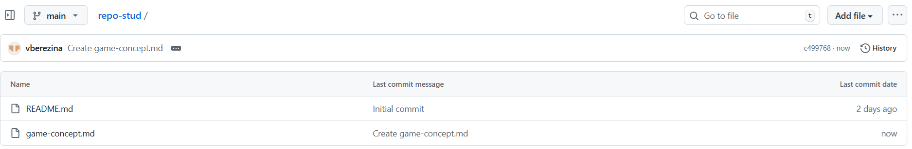

Теперь если перейти на главную страницу репозитория, то справа можно увидеть количество коммитов в этой ветке:
> Чтобы перейти на главную страницу репозитория щелкните на _**название репозитория**_ рядом с выбором _веток_  
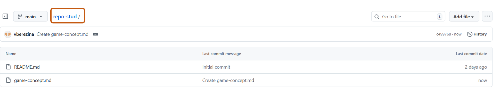

Щелкните, чтобы увидеть историю коммитов:
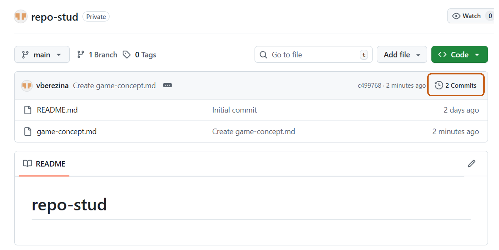

Вы увидите что-то похожее:
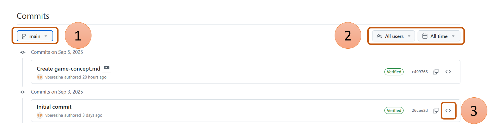

1. Переключение веток.
> Сейчас у нас только одна (главная) ветка `main`. Но совсем скоро это изменится.

2. Фильтры коммитов.
> С репозиторием могут работать несколько людей и в разное время. Соответственно, коммиты можно отсортировать по _пользователям_ и по _дате_.

3. Browse repository at this point.
> Главное преимущество систем контроля версий — **возможность вернуться к любому слепку**.  
Например, вы _добавили изменения_ в репозиторий, а через какое-то время хотите **их откатить**. Чтобы это сделать вы находите **коммит до изменений** и загружаете его.

Если щелкнуть на сам коммит, то откроется подробная информация выбранного коммита:

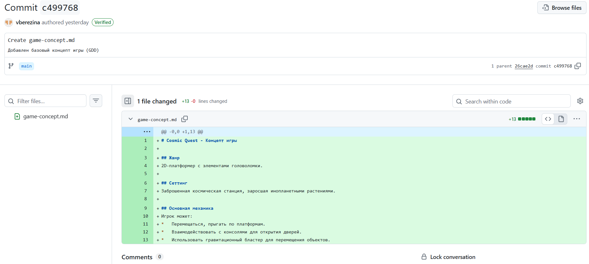

Теперь давайте внесем изменения в существующий файл в репозитории. Для этого откройте файл `game-concept.md` и нажмите _кнопку редактирования_:

> Чтобы открыть файл можете перейти на главную страницу репозитория и выбрать из списка файлов.
 
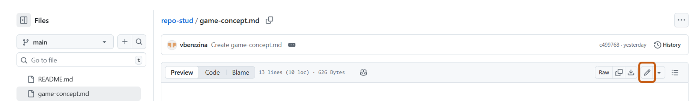

Добавьте в конец файла что-нибудь про сюжет и затем нажмите `Commit changes`

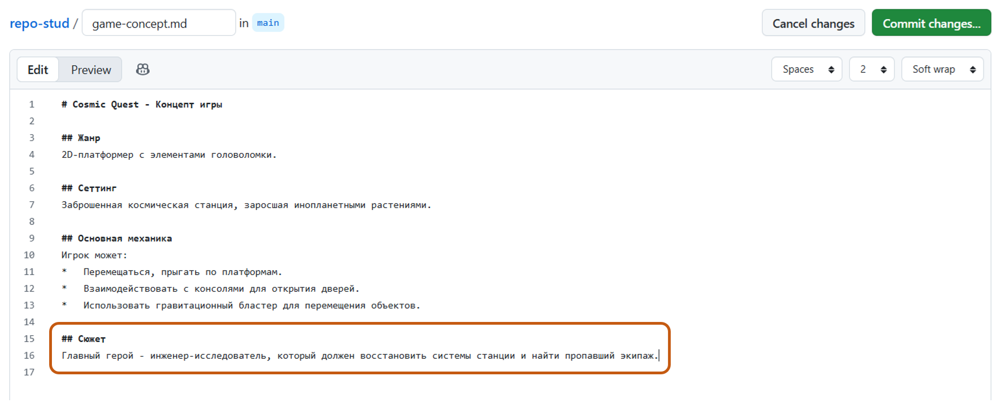

Вот и второй ваш коммит:
> `Commit messege` уже начинается с `update`. 

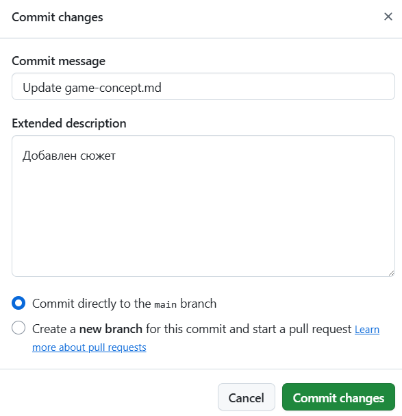

Теперь если вы перейдете в только что созданный коммит, то увидите какие именно изменения были внесены:

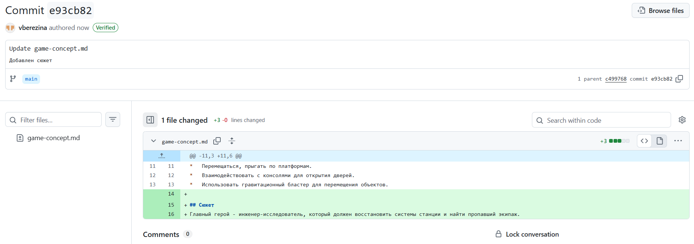

### Работа с ветками

На главной странице репозитория нажмите на выпадающий список с веткой `main` и выберите `View all branches`. Вы увидите что-то похожее:


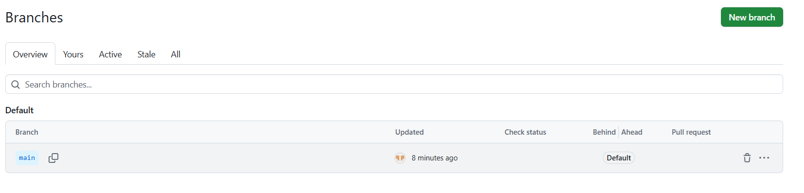

Чтобы создать новую ветку нажмите на `New branch` и присвойте ей имя `player-character`. Если всё прошло успешно, то вы увидите что-то похожее:

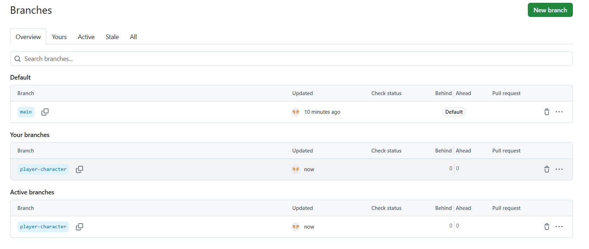

Теперь на главной странице репозитория поменяйте ветку на только что добавленную:

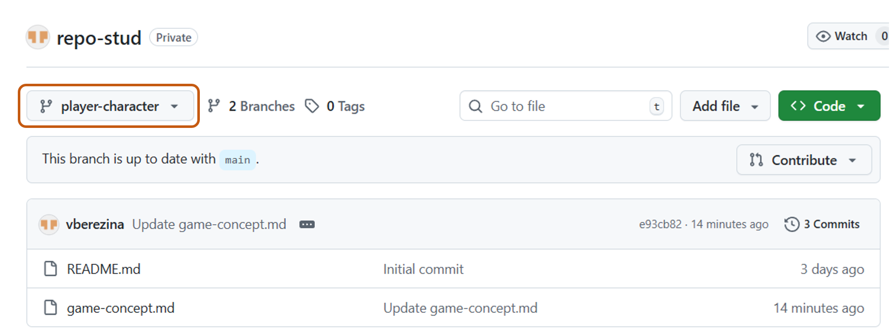

Затем добавьте в репозиторий новый файл `player.md`

> Обратите внимание, что ветка, в которую добавляется файл изменилась.

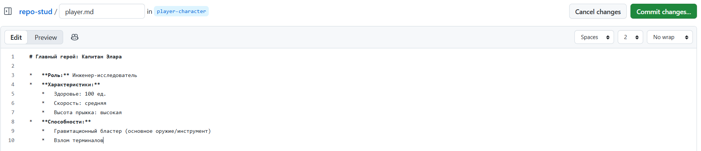

Закоммитьте изменения:

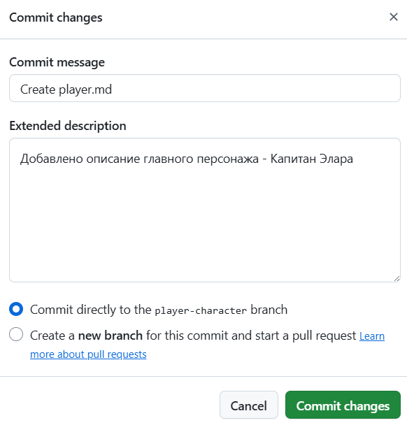

Теперь если вы перейдете на главную страницу репозитория, то появится вот такая плашка вверху:

> В ветку `player-character` были внесены изменения, но в главной ветке они не отражены. 

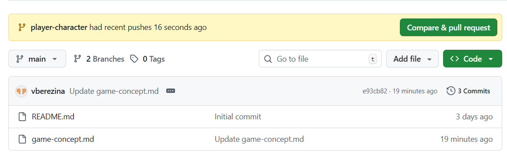

Нажмите на `Compare and pull request` и откроется вот такая страница:

> Добавьте описание и нажмите на большую зеленую кнопку

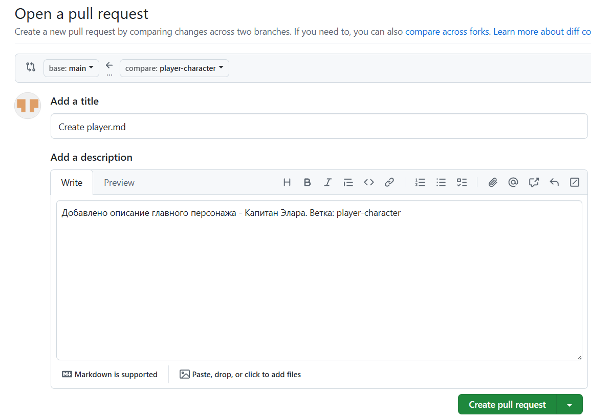

Теперь у вас есть открытые пул реквесты:

> Пока что не **мержите**! Добавим еще одну ветку и сразу обе сольём с `main`.

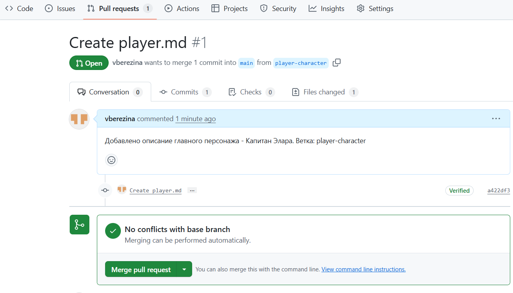

Теперь создайте еще одну ветку с врагами и добавьте файл с описанием врагов:

> ветка: `enemies`,  
файл: `enemies.md`,  
описание коммита: `Добавление системы противников`

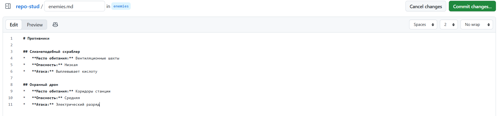

Затем создайте `Pull Request` для ветки `enemies` так же, как и для первой.

Теперь на вкладке `Pull requests` вы увидите два активных PR.

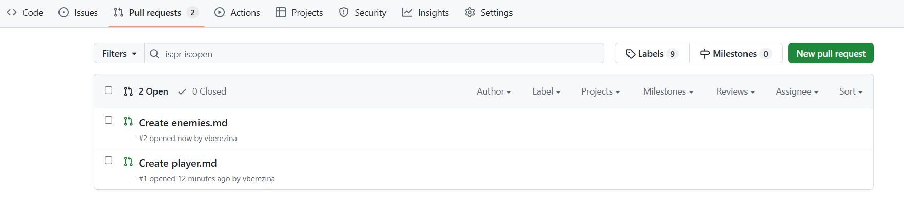

Последовательно "влейте" эти ветки в главную ветку.

Для этого щелкните по первому пул реквесту и нажмите `Merge pull request`, а затем `Confirm merge`

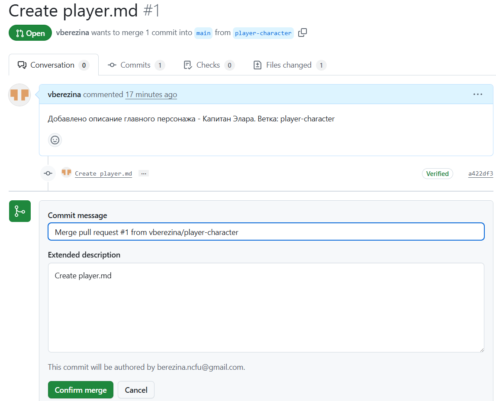

Повторите с другой веткой.

Если всё прошло успешно, то на главной странице репозитория вы увидите что-то похожее:

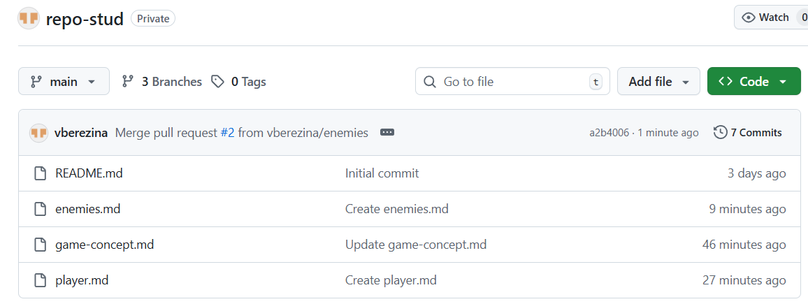

> *Итоги*:  
**main** — это стабильная, рабочая версия вашего Game Design Document.  
**Ветка (branch)** — это изолированное пространство для разработки новой функции (персонажа, врага, уровня) без риска сломать основной концепт.  
**Pull Request** — это не только запрос на слияние, но и место для обсуждения и `review` предлагаемых изменений в game design (механики, баланс, лор).  
**Слияние (merge)** — это интеграция готовой и проверенной функции в основную версию игры.

## Задания

_Перед выполнением заданий рекомендуется ознакомиться с [учебной задачей](#Учебная-задача)._

### Задание 1. Подготовка
Зарегистрируйтесь на [**```github.com```**](https://github.com) и создайте **репозиторий**, в котором будет ваша биография.


### Задание 2. Наполнение репозитория
В ветке **```main```** добавьте свои _ФИО_ и _группу_.  

Создайте две ветки: одну для **образования** (например, _education_) и вторую для **навыков** (например, _skills_). В каждую из созданных веток добавьте соответствующую информацию.


### Задание 3. Update and Merge

В каждую из веток добавьте еще немного информации о себе и **смержите** все ветки с **```main```**.

## Контрольные вопросы

1. Что такое система контроля версий? Для чего она нужна и где может быть использована?
2. Что такое репозиторий?
3. Что такое коммит (commit)? Почему каждое изменение должно сопровождаться осмысленным сообщением коммита?
4. Объясните разницу между публичным (Public) и приватным (Private) репозиторием. В каком случае какой лучше использовать?
5. Что такое ветка (branch) в Git? Как вы можете определить, в какой ветке вы сейчас находитесь, глядя на интерфейс GitHub?