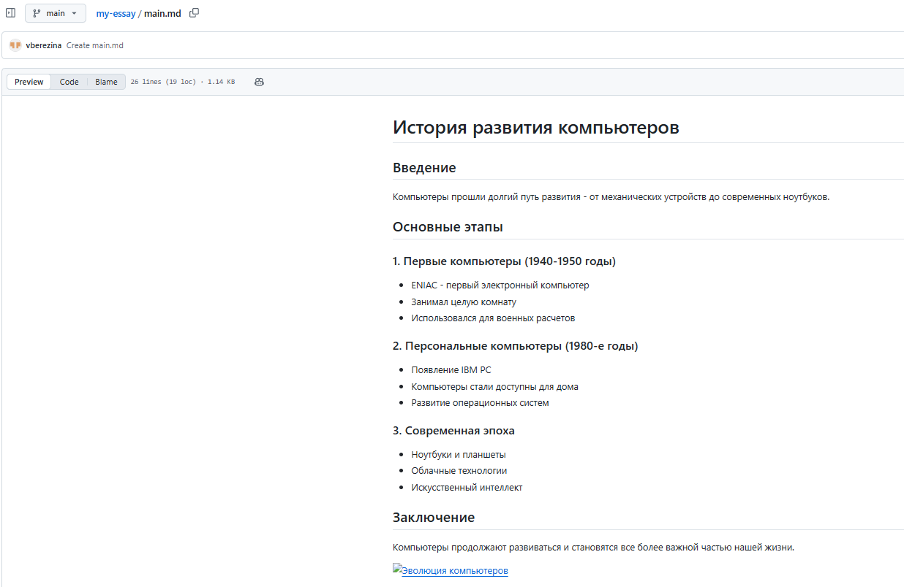
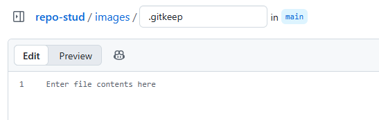
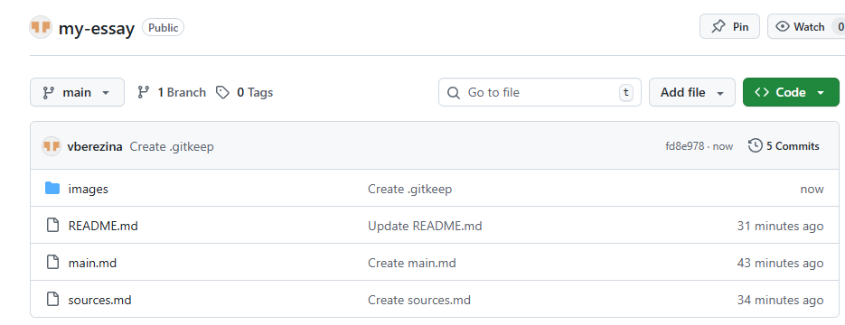
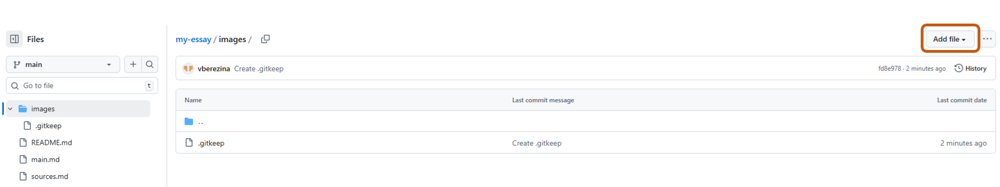
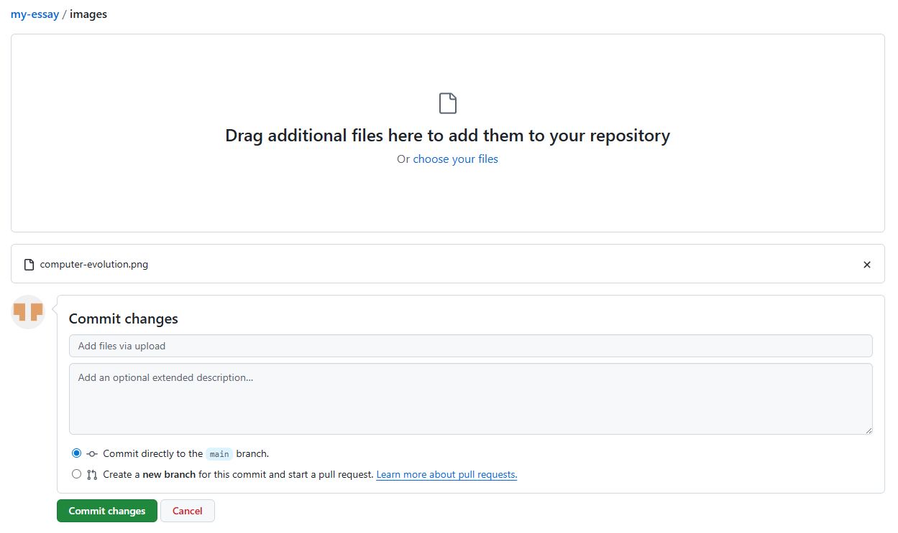
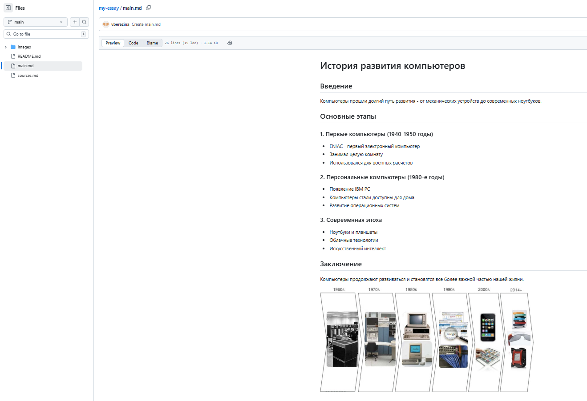
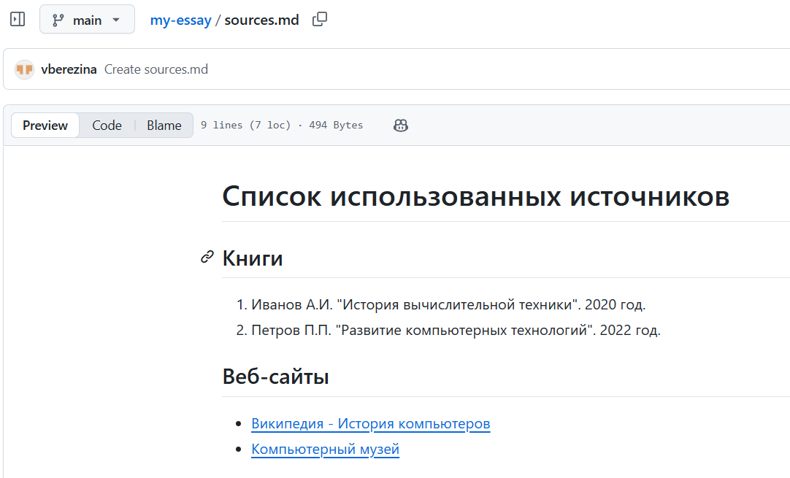
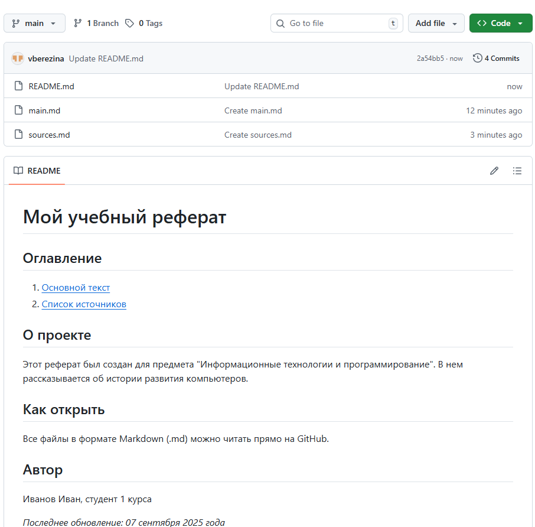
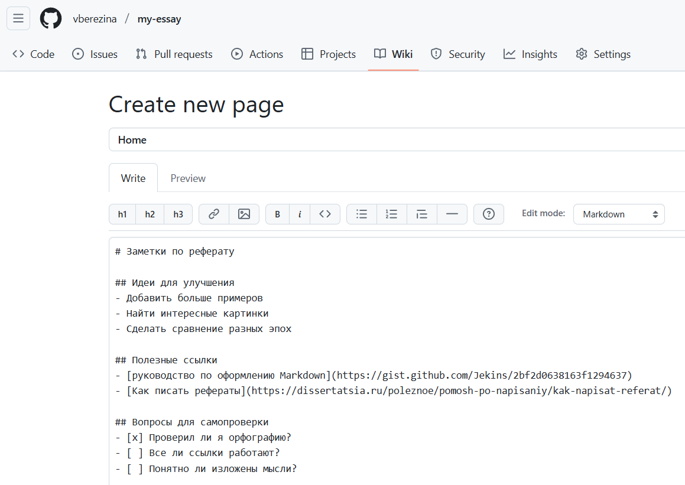

# ПРАКТИЧЕСКАЯ РАБОТА №2. Язык Markdown: Оформление документации на GitHub
🔝 [ Все практические работы](../../README.md)  
🔙 [ Основы Git: От репозитория до первого коммита](../PR1/PR1.md)  
🔜  Git локально: Работа с GitHub Desktop
***

## Содержание

🔍 [Теория](#Теория)  
💡 [Полезные ссылки](#Полезные-ссылки)  
⚔️ [Учебная задача](#Учебная-задача)  
📋 [Задания](#Задания)  
🚩 [Контрольные вопросы](#Контрольные-вопросы)

*** 

## Теория

**Markdown** — это облегченный язык разметки, созданный Джоном Грубером в 2004 году. Его основная цель — сделать написание контента для веба простым и читаемым даже в сыром виде.

*Преимущества Markdown*:
* **Простота** — синтаксис интуитивно понятен
* **Читаемость** — файлы удобно читать даже без обработки
* **Универсальность** — конвертируется в HTML, PDF, Word
* **Поддержка** — работает на GitHub, в блогах, мессенджерах

Важно понимать, что не существует единого стандарта Markdown. Разные платформы и инструменты добавляют свои расширения к базовому синтаксису. Эти разновидности называются **flavors** (букв. «вкусы»).

### Базовый синтаксис Markdown

Уровни заголовков создаются с помощью символа `#`:

```markdown
# Заголовок 1 уровня
## Заголовок 2 уровня
### Заголовок 3 уровня
```

Выделение текста:

```markdown
*курсив* или _курсив_
**жирный** или __жирный__
***жирный курсив***
~~зачеркнутый текст~~
```
Маркированный список:

```markdown
- Пункт 1
- Пункт 2
  - Вложенный пункт
```

Нумерованный список:

```markdown
1. Первый пункт
2. Второй пункт
   1. Вложенный пункт
```

Чек-листы:

```markdown
- [x] Выполненная задача
- [ ] Невыполненная задача
```

Ссылки:

```markdown
[текст ссылки](https://example.com)
```

Изображения:

```markdown

```

Строчный код:
```markdown
`код`
```

Блок кода:
```markdown
```python
print("Hello World!")```
```

Цитаты:
```markdown
> Это цитата
> > Вложенная цитата
```

Таблицы:
```markdown
| Заголовок 1 | Заголовок 2 |
|-------------|-------------|
| Ячейка 1    | Ячейка 2    |
| Ячейка 3    | Ячейка 4    |
```

### Применение Markdown в GitHub

**Файл `README.md`**  

Главная страница репозитория, содержит:
* Описание проекта
* Инструкции по установке
* Примеры использования
* Информацию о лицензии

**Wiki-документация**  

Многостраничная документация с:
* Руководствами
* FAQ
* Примеры кода
* Описанием API

**Issues и Pull Requests**  

Используется для:
* Описания багов
* Предложений новых функций
* Обсуждения кода
* Ведения задач


## Полезные ссылки
1. [Руководство по оформлению Markdown файлов](https://gist.github.com/Jekins/2bf2d0638163f1294637)
2. [Туториал по маркдауну](https://www.markdowntutorial.com/)
3. [Официальный гайд](https://www.markdownguide.org/getting-started/)
4. [Онлайн редактор](https://dillinger.io/)
5. [GitHub Markdown](https://github.github.com/gfm/)


## Учебная задача

Создадим новый публичный репозиторий с названием `my-essay` 

> Обязательно добавьте `README.md`

Структура реферата может выглядеть следующим образом:
```
мой-реферат/
├── README.md                    # Оглавление и описание
├── main.md                      # Основной текст работы
├── sources.md                   # Список источников
└── images/                      # Папка с картинками
    └── computer-evolution.png   # Пример картинки
```

Создадим файл `main.md` с таким содержанием:

```Markdown
# История развития компьютеров

## Введение
Компьютеры прошли долгий путь развития - от механических устройств до современных ноутбуков.

## Основные этапы

### 1. Первые компьютеры (1940-1950 годы)
- ENIAC - первый электронный компьютер
- Занимал целую комнату
- Использовался для военных расчетов

### 2. Персональные компьютеры (1980-е годы)
- Появление IBM PC
- Компьютеры стали доступны для дома
- Развитие операционных систем

### 3. Современная эпоха
- Ноутбуки и планшеты
- Облачные технологии
- Искусственный интеллект

## Заключение
Компьютеры продолжают развиваться и становятся все более важной частью нашей жизни.


```
В `Preview` выглядеть это будет как-то вот так:




> Обратите внимание, что картинка внизу не будет отображаться, потому что она еще не загружена в репозиторий по своему адресу.  
Давайте это исправим.


Найдите картинку и скачайте себе на компьютер. 

Давайте посмотрим на ссылку: `images/computer-evolution.png`

`images/` - это папка в которой лежит картинка с названием `computer-evolution.png`

> Проблема в том, что в нашем репозитории **нет такой папки**. И если мы сейчас загрузим эту картинку, то она будет *лежать в корне* и **ссылка работать не будет**. Решения два:  
    1. Исправить ссылку.  
    2. Добавить папку.

Выберем второй, потому что он чуть сложнее, но интереснее😄 

> **В веб-интерфейсе пустую папку создать нельзя.**  
*Но можно создать файл заглушку в папке, а потом в эту папку добавить нашу картинку.*

Начните добавлять файл как обычно через `Add file` -> `Create new file`

Всё время до этого, в поле `Name your file...` вы просто писали название файла и расширение `.md`. Но в этом поле можно написать название создаваемой папки и потом уже только сам файл. Вот так:  
`images/.gitkeep`



Теперь в нашем репозитории есть папка `images`



Перейдите в эту папку и вот уже в ней нажмите `Add file` -> `Upload files`



Выберите файл и закоммитьте:

> Обратите внимание на название и расширение картинки. Они должны совпадать с той ссылкой, указанной выше.



Если всё сделано правильно, то в `Preview` файла `main.md` вы увидите свою картинку:




Теперь добавим файл `sources.md`, в котором будет хранится список источников.
Содержание файла может быть вот такое:

``` markdown
# Список использованных источников

## Книги
1. Иванов А.И. "История вычислительной техники". 2020 год.
2. Петров П.П. "Развитие компьютерных технологий". 2022 год.

## Веб-сайты
- [Википедия - История компьютеров](https://en.wikipedia.org/wiki/History_of_personal_computers)
- [Компьютерный музей](https://computer-museum.ru)
```



Теперь оформим главную страницу репозитория. Для этого отредактируйте файл `README.md`

```markdown

# Мой учебный реферат

## Оглавление
1. [Основной текст](main.md)
2. [Список источников](sources.md)

## О проекте
Этот реферат был создан для предмета "Информационные технологии и программирование". 
В нем рассказывается об истории развития компьютеров.

## Как открыть
Все файлы в формате Markdown (.md) можно читать прямо на GitHub.

## Автор
Иванов Иван, студент 1 курса

*Последнее обновление: 07 сентября 2025 года*
```



И напоследок создадим вики-страницу для нашего реферата. Для этого перейдите в Wiki и нажмите `Create the first page`


> Если по какой-то причине вам не удаётся это сделать, то проверьте настройки: `Settings` -> `Features` -> `Wikis`

Добавьте вот такое содержание:

```markdown
# Заметки по реферату

## Идеи для улучшения
- Добавить больше примеров
- Найти интересные картинки
- Сделать сравнение разных эпох

## Полезные ссылки
- [руководство по оформлению Markdown](https://gist.github.com/Jekins/2bf2d0638163f1294637)
- [Как писать рефераты](https://dissertatsia.ru/poleznoe/pomosh-po-napisaniy/kak-napisat-referat/)

## Вопросы для самопроверки
- [x] Проверил ли я орфографию?
- [ ] Все ли ссылки работают?
- [ ] Понятно ли изложены мысли?
```



> Не забудьте сохранить страницу.

Если возникли затруднения, то можете ознакомиться с [репозиторием учебной задачи](https://github.com/vberezina/my-essay).


## Задания
_Перед выполнением заданий рекомендуется ознакомиться с [учебной задачей](#Учебная-задача)._

### Задание 1. Подготовка

Создайте репозиторий для вашего реферата. Не забудьте сразу добавить `README.md`

### Задание 2. Наполнение контентом

Добавьте основную часть и список источников.  

Затем отредактируйте главную страницу репозитория (`README.md`) и добавьте:
* навигацию (оглавление);
* сведения о проекте и авторе. 

### Задание 3. Простая вики-страница

Создайте простую страницу в Wiki.


## Контрольные вопросы

1. Для чего нужен файл README.md в репозитории?
2. Какую информацию обычно размещают в файле `README.md`?
3. Как создать заголовок первого уровня в Markdown?
4. Как создать нумерованный список в Markdown?
5. Для чего нужна вики-страница в репозитории?