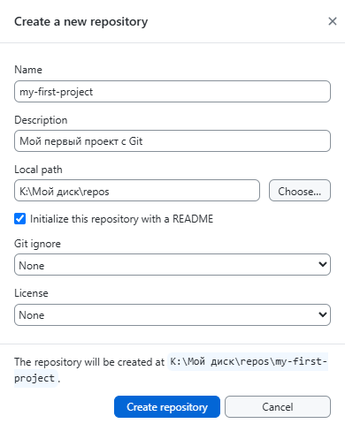
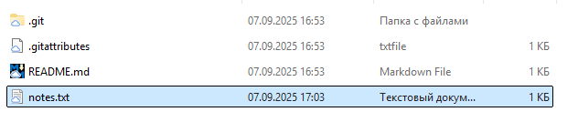
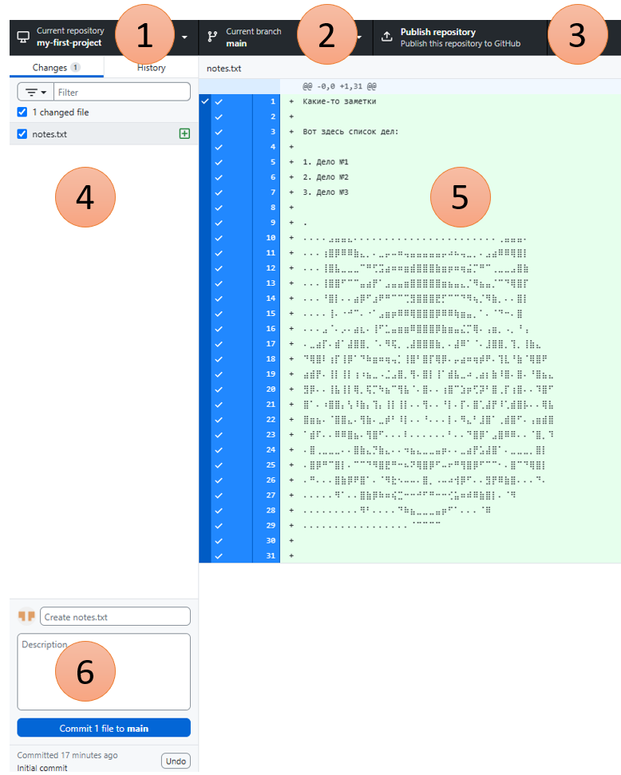
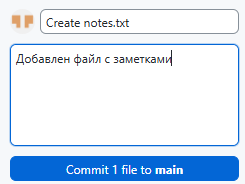
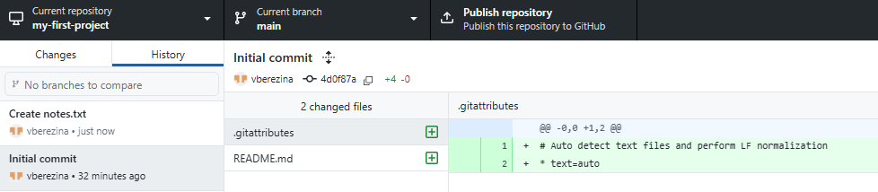
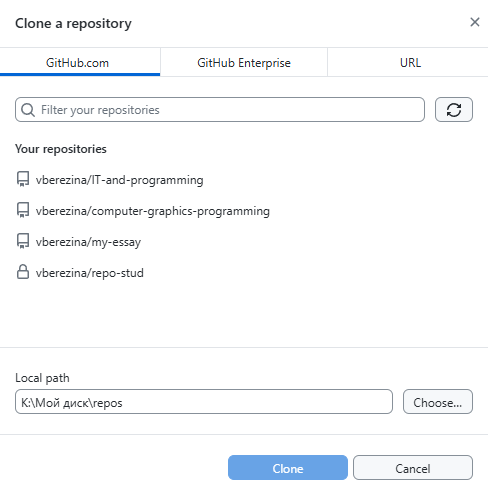

# ПРАКТИЧЕСКАЯ РАБОТА №3. Git локально: Работа с GitHub Desktop
🔝 [ Все практические работы](../../README.md)  
🔙 [ Язык Markdown: Оформление документации на GitHub](../PR2/PR2.md)  
🔜  [Ваш первый веб-сайт: HTML + CSS на GitHub Pages](../PR4/PR4.md)  
***

## Содержание

🔍 [Теория](#Теория)  
💡 [Полезные ссылки](#Полезные-ссылки)  
⚔️ [Учебная задача](#Учебная-задача)  
📋 [Задания](#Задания)  
🚩 [Контрольные вопросы](#Контрольные-вопросы)

*** 

## Теория

**Система контроля версий (Version Control System - VCS)** — это программное обеспечение, которое помогает отслеживать изменения в файлах и координировать работу нескольких людей над общими файлами.

Основные виды _VCS_:

* **Локальные** — версии хранятся на локальном компьютере (*RCS*, *SCCS*)

* **Централизованные** — единый сервер хранит все версии (*SVN*, *CVS*)

* **Распределенные** — каждый участник имеет полную копию репозитория (*Git*, *Mercurial*)

Ключевые понятия:

* **Репозиторий** — хранилище всех версий файлов и метаданных

* **Коммит** — снимок состояния файлов в определенный момент времени

* **Ветка** — указатель на определенный коммит

* **Рабочая область** — текущее состояние файлов

* **Область подготовки (Staging Area)** — промежуточная область между рабочей областью и репозиторием

Три состояния файлов в Git:

1. **Modified** — измененный в рабочей области

1. **Staged** — подготовленный к коммиту

1. **Committed** — сохраненный в репозитории

**GitHub Desktop** — это кроссплатформенное приложение, которое предоставляет визуальный интерфейс для работы с Git. Оно абстрагирует сложные командные операции, делая работу с системой контроля версий более доступной.

*Преимущества GitHub Desktop:*

* Визуальное представление истории коммитов

* Упрощенное управление ветками

* Интеграция с платформой GitHub

* Визуальное разрешение конфликтов

* Поддержка больших файлов через Git LFS

**GitHub** — это платформа для хостинга Git-репозиториев с дополнительными функциями:

* Pull Requests для code review

* Issues для отслеживания задач

* Actions для CI/CD

* Wiki для документации

* Projects для управления проектами

**Протоколы доступа**:

* **HTTPS** — простая настройка, требует аутентификации

* **SSH** — более безопасный, использует ключи

**Структура коммитов:**

* Одно логическое изменение в одном коммите

* Четкие сообщения коммитов

* Следование *conventional commits*

**Безопасность:**

* Никогда не коммитьте чувствительные данные

* Используйте SSH ключи вместо паролей

* Включайте двухфакторную аутентификацию

* Регулярно обновляйте клиенты Git

**Типичный workflow (рабочий процесс):**

1. Получить последние изменения: `git pull`

1. Создать feature ветку: `git checkout -b feature/name`

1. Внести изменения и протестировать

1. Добавить файлы в staging: `git add` .

1. Создать коммит: `git commit -m "message"`

1. Отправить изменения: `git push origin feature/name`

1. Создать `Pull Request` на GitHub

1. Пройти `code review`

1. Слить изменения в `main`

**Типы конфликтов:**

* Конфликты слияния при `merge`

* Конфликты перебазирования при `rebase`

* Конфликты `cherry-pick`

**Стратегии разрешения:**

* Ручное редактирование конфликтующих файлов

* Использование инструментов слияния (_meld_, _kdiff3_)

* Принятие текущих или входящих изменений


## Полезные ссылки
1. [Официальная документация Git (книга Pro Git) ](https://git-scm.com/book/ru/v2)
2. [Документация по GitHub](https://docs.github.com/ru)
2. [Обучалки Github по тематикам](https://resources.github.com/learn/pathways/)


## Учебная задача

Начнём с установки Git на компьютер. Руководство по установке на разные ОС находится вот [здесь](https://git-scm.com/book/ru/v2/%D0%92%D0%B2%D0%B5%D0%B4%D0%B5%D0%BD%D0%B8%D0%B5-%D0%A3%D1%81%D1%82%D0%B0%D0%BD%D0%BE%D0%B2%D0%BA%D0%B0-Git).

> Выберите свою ОС и следуйте инструкциям.

Чтобы проверить установку, откройте командную строку и введите команду:
```bash
git --version
```
> Должна отобразиться версия Git (например: `git version 2.51.0`)

Теперь перейдем к настройке:

```bash
git config --global user.name "Ваше Имя"
git config --global user.email "your.email@example.com"
```

> У вас уже должна быть учетка на гитхабе, поэтому можете ввести **логин** и **e-mail** оттуда

Чтобы посмотреть все установленные настройки и узнать где именно они заданы, используйте команду:

```bash
git config --list --show-origin
```

Теперь установим `Github Desktop`.  
Для этого перейдите по [ссылке](https://github.com/apps/desktop) и скачайте установочный файл.

После установки запустите приложение и войдите в свой аккаунт `GitHub`.

Настройте основные параметры:  

* Name: Ваше имя  

* Email: Ваш email

Создадим новый репозиторий через `Github Desktop`. Для это нажмите `File` -> `New repository...`



> У вас на диске появилась папка по указанному вами пути. Это ваш локальный репозиторий.

Теперь перейдите в папку и добавьте какие-нибудь файлы. Например, создайте текстовый файл `notes.txt` и добавьте в него информацию.

> Обратите внимание, что папка репозитория **не пустая**. В ней содержатся:  
`README.md` — уже знакомый нам файл (*при условии, что вы указали, что его нужно добавить*).  
`.gitattributes` — для согласования настроек.  
`.git` — папка, которая содержит информацию, необходимую для работы системы контроля версий Git.



Теперь перейдите в `Github Desktop`



1. Открытый репозиторий
> Можно переключаться между существующими репозиториями.

2. Текущая ветка
> Можно переключаться между ветками и здесь же создавать новые.

3. Публикация на github

> Сейчас наш репозиторий нельзя увидеть в учетке гитхаба, потому что он не опубликован. 

4. Файлы, в которых есть изменения
> В списке всего один файл, потому что изменен (в данном случае добавлен) один файл в репозитории.

5. Сами изменения 
> Т.к. файл был только что создан, то все данные считаются добавлением в файл. 

6. Создание коммита
> Название коммита и его описание.

Закоммитьте изменения:



Все коммиты можно посмотреть в `History`:



> Здесь же можно выбрать любой коммит, вызвать контекстное меню и нажать `checkout commit`, что позволит извлечь состояние репозитория Git на определенный момент времени, то есть просмотреть определенный коммит, а не текущую версию проекта.  
Другими словами, это возможность загрузить предыдущие варианты проекта до каких-то изменений.


Опубликуйте репозиторий (`Publish repository`) и удостоверьтесь, что он появился в списке в вашей учетке [github](https://github.com/).

Теперь давайте клонируем себе на ПК уже существующий на гитхабе репозиторий. Для этого в `Github Desktop` нажмите `File` -> `Clone repository...`



Если это ваш репозиторий, то просто выберите его из списка в первой вкладке и выберите локальный путь на диске.

Чтобы клонировать чужой репозиторий, то нужно взять его `url` на главной странице репозитория.
>Подробнее про это может почитать вот [здесь](https://docs.github.com/ru/repositories/creating-and-managing-repositories/cloning-a-repository)

Создайте локальную копию какого-нибудь своего репозитория и убедитесь, что теперь он ничем не отличается от того, который был создан через `Github Desktop`
> *На самом деле некоторые отличия есть.* Когда вы опубликовали свой репозиторий или клонировали существующий, то после внесения изменений `Publish repository` поменяется на   `Push origin`.  
`Push origin` — отправка изменений из локального репозитория в удаленный репозиторий

## Задания
_Перед выполнением заданий рекомендуется ознакомиться с [учебной задачей](#Учебная-задача)._

### Задание 1. Подготовка

Установите и настройте `Git` и `Github Desktop`.

### Задание 2. Работа с Github Desktop

Создайте или клонируйте репозиторий. 

### Задание 3. Коммиты

Создайте несколько коммитов (добавьте файлы, измените их), а затем запушьте (`Push origin`) в удалённый репозиторий.


## Контрольные вопросы

1. Для чего нужны команды `git config --global user.name` и `git config --global user.email`?
2. Как проверить, что Git установлен корректно?
3. Как просмотреть историю изменений в репозитории?
4. Что такое ветка в Git и для чего она используется?
5. Для чего нужен файл `.gitignore`?