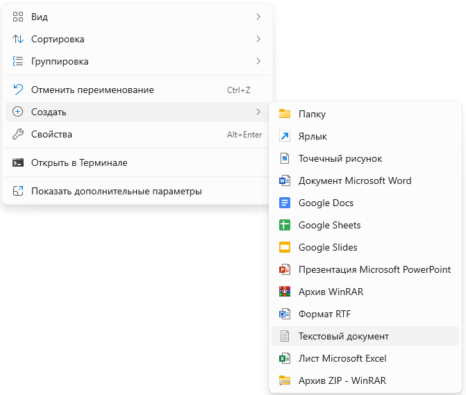
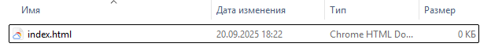
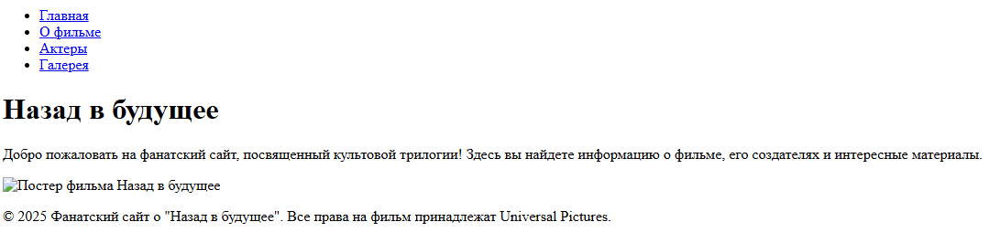
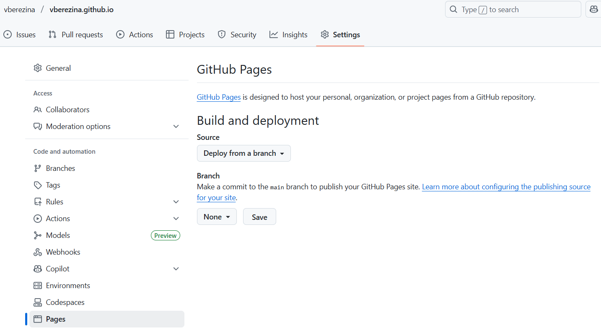
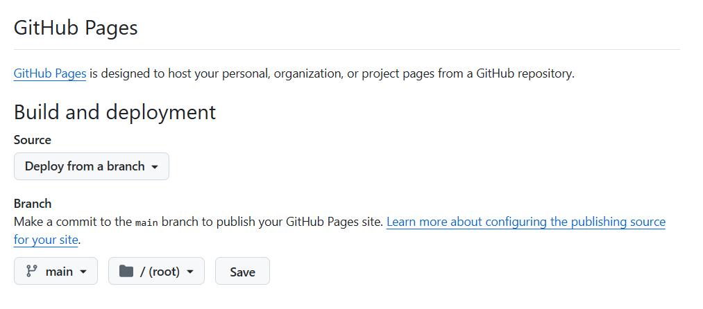

# ПРАКТИЧЕСКАЯ РАБОТА №4. Ваш первый веб-сайт: HTML + CSS на GitHub Pages
🔝 [ Все практические работы](../../README.md)  
🔙 [ Git локально: Работа с GitHub Desktop](../PR3/PR3.md)  
🔜  Python в облаке: Первые шаги в Google Colab
***

## Содержание

🔍 [Теория](#Теория)  
💡 [Полезные ссылки](#Полезные-ссылки)  
⚔️ [Учебная задача](#Учебная-задача)  
📋 [Задания](#Задания)  
🚩 [Контрольные вопросы](#Контрольные-вопросы)

*** 

## Теория

### Язык разметки HTML

**HTML** (HyperText Markup Language) — это стандартный язык разметки для создания веб-страниц. Это не язык программирования, а именно язык **разметки**, который определяет структуру и семантическое содержание веб-страницы.

Базовая структура HTML-документа:

```html
<!DOCTYPE html>
<html lang="ru">
<head>
    <meta charset="UTF-8">
    <meta name="viewport" content="width=device-width, initial-scale=1.0">
    <title>Название страницы</title>
</head>
<body>
    <!-- Содержание страницы -->
    <h1>Заголовок</h1>
    <p>Абзац текста</p>
</body>
</html>
```


`<!DOCTYPE html>` — объявление типа документа, всегда должна быть первой строкой.

`<html>` — корневой элемент всей страницы. Атрибут lang указывает язык содержимого.

`<head>` — служебная часть документа (метаданные, заголовок, подключение стилей и скриптов).

`<body>` — видимое содержание страницы, то что видят пользователи.

**Заголовки (иерархия от h1 до h6):**
```html
<h1>Главный заголовок</h1>
<h2>Подзаголовок</h2>
<h3>Третий уровень</h3>
```
**Абзацы и текст:**
```html
<p>Обычный абзац текста.</p>
<strong>Важный текст (жирный)</strong>
<em>Акцентированный текст (курсив)</em>
<br> <!-- перенос строки -->
<hr> <!-- горизонтальная линия -->
```

**Списки:**
```html
<!-- Маркированный список -->
<ul>
    <li>Пункт 1</li>
    <li>Пункт 2</li>
</ul>

<!-- Нумерованный список -->
<ol>
    <li>Первый пункт</li>
    <li>Второй пункт</li>
</ol>

<!-- Список определений -->
<dl>
    <dt>Термин</dt>
    <dd>Определение</dd>
</dl>
```

**Ссылки:**
```html
<!-- Внешняя ссылка -->
<a href="https://example.com">Текст ссылки</a>

<!-- Внутренняя ссылка -->
<a href="about.html">О нас</a>

<!-- Якорь внутри страницы -->
<a href="#section1">Перейти к разделу</a>

<!-- Ссылка с новым окном -->
<a href="https://example.com" target="_blank">Открыть в новом окне</a>

<!-- Ссылка на email -->
<a href="mailto:email@example.com">Написать нам</a>
```

**Изображения:**
```html

```

* `src` — путь к изображению

* `alt` — альтернативный текст (обязателен для доступности)

* `width/height` — размеры (лучше задавать в CSS)

**Таблицы:**
```html
<table>
    <thead>
        <tr>
            <th>Заголовок 1</th>
            <th>Заголовок 2</th>
        </tr>
    </thead>
    <tbody>
        <tr>
            <td>Ячейка 1</td>
            <td>Ячейка 2</td>
        </tr>
    </tbody>
    <tfoot>
        <tr>
            <td>Итого</td>
            <td>100</td>
        </tr>
    </tfoot>
</table>
```
### Семантическая разметка (HTML5)

**Блочные семантические элементы:**
```html
<header>Шапка сайта</header>
<nav>Навигационное меню</nav>
<main>Основное содержание</main>
<section>Секция документа</section>
<article>Самостоятельная статья</article>
<aside>Боковая панель</aside>
<footer>Подвал сайта</footer>
```

**Строчные семантические элементы:**
```html
<time datetime="2023-12-15">15 декабря</time>
<mark>Выделенный текст</mark>
<code>код программы</code>
<cite>Цитата или ссылка на источник</cite>
```

### Атрибуты элементов

**Глобальные атрибуты (доступны почти всем элементам):**
```html
<div id="unique-id">Уникальный идентификатор</div>
<div class="class-name">Имя класса</div>
<div style="color: red;">Inline стили</div>
<div title="Всплывающая подсказка">Наведи на меня</div>
<div hidden>Скрытый элемент</div>
<div contenteditable="true">Редактируемый контент</div>
```
**Специфические атрибуты:**
```html

<a href="#section" target="_blank">Ссылка</a>
<input type="text" required disabled>
```

### CSS (Каскадные таблицы стилей)

CSS (Cascading Style Sheets) — это язык, который управляет **внешним видом** и **расположением** элементов на HTML-странице. Если HTML — это скелет и органы сайта, то CSS — это его кожа, одежда и макияж.

Каждый кусочек CSS-кода состоит из одного или нескольких **правил**. Каждое правило устроено так:
```css
селектор {
    свойство: значение;
    свойство: значение;
}
```

Например,
```css
h1 {
    color: blue;
    font-size: 24px;
    text-align: center;
   }
```

**Селектор** указывает, к каким HTML-элементам применять стили. Браузер ищет на странице все элементы, которые подходят под описание селектора.

**Основные типы селекторов:**

* `тег` — по имени тега: `p`, `h1`, `div`

* `.класс` — по классу: `.menu`, `.article`

* `#идентификатор` — по id: `#header`, `#main-content`

* `[атрибут]` — по атрибуту: `[href]`, `[type="text"]`


**Свойство** - это конкретная характеристика внешнего вида. Например, `color`, `font-size`, `margin`, `background`, `border`.

**Значение** - это конкретное значение для свойства. Например, `red`, `24px`, `10%`, `#ff0000`.

**Декларация** - это пара `свойство: значение;`. Например, `color: blue;`

**Блок деклараций** - все декларации внутри фигурных скобок `{}`.

Есть 3 способа подключить стили:

1. Внешняя таблица стилей (Рекомендуемый способ)  
```html
<head>
    <link rel="stylesheet" href="style.css">
</head>
```
2. Внутренние стили (в теге `<style>`)  
```html
<head>
    <style>
        body { background: #f0f0f0; }
        h1 { color: blue; }
    </style>
</head>
```
3. Inline-стили (не рекомендуется)
```html
<h1 style="color: blue; font-size: 24px;">Заголовок</h1>
```

#### Каскадность и специфичность (Cascade & Specificity)  


**Каскадность.** Когда несколько правил применяются к одному элементу, браузер определяет, какое из них "победит". Последнее правило имеет приоритет (если специфичность одинакова).  
**Пример:**
```css
p { color: black; }    /* Будет применено */
p { color: blue; }     /* Перезапишет предыдущее */
```

**Специфичность.** "Вес" селектора, который определяет его приоритет. *Порядок приоритета*: `!important` > `inline` > `id` > `class` > `tag`

Пример:
```css
p { color: black; }            /* вес: 1 (тег) */
.text { color: blue; }         /* вес: 10 (класс) */
#main { color: red; }          /* вес: 100 (id) */
p.text { color: green; }       /* вес: 1+10=11 */
```
### Основные категории CSS-свойств
1. Текстовые свойства
```css
p {
    color: #333333;            /* цвет текста */
    font-family: Arial;        /* шрифт */
    font-size: 16px;           /* размер шрифта */
    font-weight: bold;         /* жирность */
    text-align: center;        /* выравнивание */
    line-height: 1.5;          /* межстрочный интервал */
}
```
2. Блочная модель (Box Model)
```css
div {
    width: 300px;             /* ширина контента */
    height: 200px;            /* высота контента */
    padding: 20px;            /* внутренние отступы */
    border: 2px solid black;  /* граница */
    margin: 30px;             /* внешние отступы */
}
```

3. Позиционирование
```css
.element {
    position: static;     /* по умолчанию */
    position: relative;   /* относительно себя */
    position: absolute;   /* относительно родителя */
    position: fixed;      /* относительно окна браузера */
    top: 10px;
    left: 20px;
}
```
4. Flexbox (для современной верстки)
```css
.container {
    display: flex;
    justify-content: center;    /* выравнивание по горизонтали */
    align-items: center;        /* выравнивание по вертикали */
    flex-direction: row;        /* направление: row/column */
}
```

Организация кода:
```css
/* 1. Сброс стилей */
* { margin: 0; padding: 0; box-sizing: border-box; }

/* 2. Общие стили */
body { font-family: Arial; line-height: 1.6; }

/* 3. Компоненты */
.button { padding: 10px 20px; border: none; }

/* 4. Секции */
.header { background: #333; color: white; }

/* 5. Медиа-запросы */
@media (max-width: 768px) {
    .menu { flex-direction: column; }
}
```

## Полезные ссылки
1. [Справочник по HTML](https://htmlbook.ru/)
2. [Ещё один справочник по HTML+CSS](https://htmlbase.ru/)
3. [Документация по GitHub Pages](https://docs.github.com/ru/pages)
4. [Официальная документация Git (книга Pro Git) ](https://git-scm.com/book/ru/v2)
5. [Документация по GitHub](https://docs.github.com/ru)


## Учебная задача

Cоздайте новый **публичный** репозиторий, который будет выглядеть следующим образом: `<user>.github.io`, где `<user>` - это имя вашей учетки. Например, если моя учетка - `vberezina`, то репозиторий будет выглядеть вот так: `vberezina.github.io`. 

Создадим первую и главную страницу `index.html`.  

Один из вариантов: в папке создайте ***текстовый документ*** и переименуйте его в `index.html`.



> У вас должна быть возможность редактировать **расширения файлов**.  
**Для Windows 11:** перейдите в *Проводник* и выберите `Просмотреть > Показать > расширения имен файлов`

Если всё сделано правильно, то тип файла с текстового документа смениться на веб-страницу.



> Если вдруг вы решите этот файл открыть в браузере, то увидите пустую страницу, потому что сам файл пустой. Но мы это сейчас исправим.

Откройте файл любым текстовым редактором. Например, Блокнотом. 

Структура веб-страницы обычно выглядит следующим образом:

``` html
<html>

    <head>

        <title>
        </title>

    </head>

    <body>
    </body>

</html>
```

`html` − главный тег, определяющий тип документа. Все остальные теги должны находиться внутри этого.  
`head` − указываются метаданные (кодировка, автор, описание и др.) и подключаются CSS.
`title` − заголовок страницы.  
`body` − содержимое страницы.

> у некоторых тегов могут быть атрибуты, которые определяют поведение или свойства.

Создадим простенький многостраничный сайт на тему: "Мой любимый фильм".

Сайт будет включать:

1. **Главную страницу** (`index.html`) — с кратким представлением темы.

2. **Страницу "О фильме"** (`about.html`) — с описанием сюжета, интересными фактами.

3. **Страницу "Актеры"** (`cast.html`) — со списком и описанием основных актеров.

4. **Страницу "Галерея"** (`gallery.html`) — с постером и несколькими кадрами из фильма.

5. **Единое навигационное меню** на всех страницах для связи между ними.

Файловая структура может выглядеть следующим образом:

```text
<user>.github.io/
├── index.html
├── about.html
├── cast.html
├── gallery.html
├── style.css       # Общий файл стилей для всех страниц
├── images/         # Папка для всех изображений
│   ├── poster.jpg
│   ├── frame1.jpg
│   ├── frame2.jpg
│   └── actor1.jpg
└── README.md
```

Создадим базовую структуру для каждой страницы(`index.html`, `about.html` и т.д.). Код будет очень похожим.

Пример кода для `index.html`:
``` html
<!DOCTYPE html>
<html lang="ru">
<head>
    <meta charset="UTF-8">
    <title>Назад в будущее - Главная</title>
    
    <!-- Подключение таблицы стилей -->
    <link rel="stylesheet" href="style.css">
    
</head>
<body>

    <!-- Навигационное меню - ОДИНАКОВОЕ НА ВСЕХ СТРАНИЦАХ -->
    <header>
        <nav>
            <ul class="menu">
                <li><a href="index.html">Главная</a></li>
                <li><a href="about.html">О фильме</a></li>
                <li><a href="cast.html">Актеры</a></li>
                <li><a href="gallery.html">Галерея</a></li>
            </ul>
        </nav>
    </header>

    <!-- Основное содержание страницы - УНИКАЛЬНОЕ ДЛЯ КАЖДОЙ СТРАНИЦЫ -->
    <main>
        <h1>Назад в будущее</h1>
        <p>Добро пожаловать на фанатский сайт, посвященный культовой трилогии! Здесь вы найдете информацию о фильме, его создателях и интересные материалы.</p>
        
    </main>

    <!-- Подвал - ОДИНАКОВЫЙ НА ВСЕХ СТРАНИЦАХ -->
    <footer>
        <p>© 2025 Фанатский сайт о "Назад в будущее". Все права на фильм принадлежат Universal Pictures.</p>
    </footer>

</body>
</html>
```

Рассмотрим следующие теги:  
*  `<link rel="stylesheet" href="style.css">` — подключение таблицы стилей, атрибут `href` - это ссылка на файл.
*   `<ul class="menu">` — маркированный список, а атрибут `class` позволит применить стиль именно к этому классу, а не ко всем тегам `ul`.
*   `<li><a href="index.html">Главная</a></li>` — вложенные теги, `li` - это пункт списка, а `a` - это ссылка (в данном случае на другую страницу).
*   `<h1>` — заголовок первого уровня.
*   `<p>` — параграф.
*   `` — тег для картинки.

Если посмотреть в браузере, то получится что-то похожее:



> Картинка не отображается, потому что её нет, а ссылки никуда не ведут, потому что файлы ещё не созданы. Давайте это исправлять.

Создайте файлы `about.html`, `cast.html` и `gallery.html`.

Пример кода для `about.html`:
``` html
<!DOCTYPE html>
<html lang="ru">
<head>
    <meta charset="UTF-8">
    <title>Назад в будущее - О фильме</title>
    <link rel="stylesheet" href="style.css"> <!-- Тот же файл стилей! -->
</head>
<body>

    <header>
        <nav>
            <ul class="menu">
                <li><a href="index.html">Главная</a></li>
                <li><a href="about.html">О фильме</a></li>
                <li><a href="cast.html">Актеры</a></li>
                <li><a href="gallery.html">Галерея</a></li>
            </ul>
        </nav>
    </header>

    <main>
        <h1>Сюжет фильма</h1> <!-- Заголовок другой -->
        <p>Подросток Марти МакФлай случайно попадает в 1955 год на машине времени, которую сконструировал его друг...</p>
        <!-- Уникальное содержание страницы "О фильме" -->
    </main>

    <footer>
        <p>© 2025 Фанатский сайт о "Назад в будущее". Все права на фильм принадлежат Universal Pictures.</p>
    </footer>

</body>
</html>
```


Пример кода для `cast.html`:
``` html
<!DOCTYPE html>
<html lang="ru">
<head>
    <meta charset="UTF-8">
    <title>Назад в будущее - Актерский состав</title>
    <link rel="stylesheet" href="style.css">
    <style>
        /* Дополнительные стили для страницы актеров */
        .actor {
            border-bottom: 2px solid #eaeaea;
            padding: 20px 0;
            margin: 20px 0;
        }
        
        .actor:last-child {
            border-bottom: none;
        }
        
        .actor img {
            border-radius: 8px;
            margin-right: 20px;
            float: left;
            box-shadow: 0 4px 8px rgba(0,0,0,0.1);
        }
        
        .actor-info {
            overflow: hidden; /* Для обтекания floated изображения */
        }
        
        .actor h2 {
            color: #2c3e50;
            margin-top: 0;
        }
        
        .clearfix::after {
            content: "";
            display: table;
            clear: both;
        }
    </style>
</head>
<body>

    <header>
        <nav>
            <ul class="menu">
                <li><a href="index.html">Главная</a></li>
                <li><a href="about.html">О фильме</a></li>
                <li><a href="cast.html">Актеры</a></li>
                <li><a href="gallery.html">Галерея</a></li>
            </ul>
        </nav>
    </header>

    <main>
        <h1>Актерский состав</h1>
        
        <div class="actor clearfix">
            
            <div class="actor-info">
                <h2>Майкл Дж. Фокс</h2>
                <p><strong>Роль:</strong> Марти МакФлай</p>
                <p><strong>Дата рождения:</strong> 9 июня 1961 года</p>
                <p>Канадский и американский актер, наиболее известный по роли Марти МакФлая в трилогии "Назад в будущее". 
                Интересный факт: на момент съемок первой части Фоксу было 24 года, хотя он играл 17-летнего подростка.</p>
            </div>
        </div>

        <div class="actor clearfix">
            
            <div class="actor-info">
                <h2>Кристофер Ллойд</h2>
                <p><strong>Роль:</strong> Доктор Эмметт Браун</p>
                <p><strong>Дата рождения:</strong> 22 октября 1938 года</p>
                <p>Американский актер, прославившийся ролью эксцентричного ученого Дока Брауна. Его фраза "Great Scott!" 
                стала одной из самых узнаваемых в истории кино. Ллойд мастерски передал образ безумного гения с добрым сердцем.</p>
            </div>
        </div>

        <div class="actor clearfix">
            
            <div class="actor-info">
                <h2>Лиа Томпсон</h2>
                <p><strong>Роль:</strong> Лоррейн Бейнс-МакФлай</p>
                <p><strong>Дата рождения:</strong> 31 мая 1961 года</p>
                <p>Американская актриса, сыгравшая маму Марти - Лоррейн. В первой части ей пришлось играть подростка, 
                влюбленного в собственного сына, что создавало уникальные комедийные ситуации. Томпсон блестяще справилась 
                с этой сложной задачей.</p>
            </div>
        </div>

        <div class="actor clearfix">
            
            <div class="actor-info">
                <h2>Томас Ф. Уилсон</h2>
                <p><strong>Роль:</strong> Бифф Таннен</p>
                <p><strong>Дата рождения:</strong> 15 апреля 1959 года</p>
                <p>Американский актер и комик, создавший один из самых запоминающихся образов кинозлодея - Биффа Таннена. 
                Интересно, что Уилсон по натуре совсем не похож на своего персонажа - он образованный и интеллигентный человек, 
                что делает его актерскую работу еще более впечатляющей.</p>
            </div>
        </div>
    </main>

    <footer>
        <p>© 2025 Фанатский сайт о "Назад в будущее". Все права на фильм принадлежат Universal Pictures.</p>
    </footer>

</body>
</html>
```

Добавить стили можно через подключение отдельного файла, либо в каждом `html` внутри тегов `<style></style>`

> Внутренние стили (`<style>...</style>`) добавлены непосредственно в HTML-файлы для удобства, но в реальном проекте лучше выносить все стили в отдельный файл `style.css`

Тег `div` — универсальный контейнер для содержимого сайта. Это такой блок, которому практически всегда присваивается атрибут `id` или `class` для последующей стилизации.

И добавим таблицу стилей. Создайте файл `style.css`.

Пример кода для `style.css`:
```css
/* style.css */
body {
    font-family: Arial, sans-serif;
    line-height: 1.6;
    margin: 0;
    padding: 0;
    background-color: #f4f4f4;
    color: #333;
}

/* Стили для шапки и меню */
header {
    background: #333;
    color: #fff;
    padding: 1rem 0;
    text-align: center;
}

.menu {
    list-style: none;
    padding: 0;
}

.menu li {
    display: inline;
    margin-right: 20px;
}

.menu a {
    color: #fff;
    text-decoration: none;
    font-weight: bold;
}

.menu a:hover {
    color: #ff9900; /* Цвет меняется при наведении */
}

/* Стили для основного содержимого */
main {
    width: 80%;
    margin: 20px auto;
    padding: 20px;
    background: #fff;
    box-shadow: 0 0 10px rgba(0,0,0,0.1);
}

/* Стили для подвала */
footer {
    text-align: center;
    padding: 1rem 0;
    background: #333;
    color: #fff;
    position: relative;
    bottom: 0;
    width: 100%;
}
```

Создайте папку `images/` и добавьте в нее картинки:
* Для `cast.html`: `michael-fox.jpg`, `loyd.jpg`, `lea-thompson.jpg`, `thomas-wilson.jpg`
* Для `gallery.html`: `poster1.jpg`, `poster2.jpg`, `poster3.jpg`, `scene1.jpg`, `scene2.jpg`, `scene3.jpg`, `scene4.jpg`, `prop1.jpg`, `prop2.jpg`, `prop3.jpg`.

> Картинки можно **скачать на сайтах с фильмами**, либо **использовать другие изображения по теме**, либо **использовать временные заполнители** (placeholder images). Если используете картинки с другими именами, то не забудьте и в коде изменить имена файлов.

Не забудьте это всё закоммитеть и запушить.

### GitHub Pages

Чтобы опубликовать сайт перейдите в настройки репозитория `<user>.github.io`. Затем выберите `Pages`



В Branch выберите main и сохраните.



С подробной инструкцией вы можете ознакомиться [здесь](https://docs.github.com/ru/pages/getting-started-with-github-pages/creating-a-github-pages-site).

И через какое-то время по адресу `<user>.github.io` появится ваш сайт. 


## Задания
_Перед выполнением заданий рекомендуется ознакомиться с [учебной задачей](#Учебная-задача)._

### Задание 1. Создание html

Создайте несколько html-страниц, объединенных одной тематикой. Например, сайт с информацией о себе (образование, хобби, группа в институте).

Страницы должны содержать заголовки, параграфы, списки, изображения, ссылки.

### Задание 2. Работа с css

Добавьте таблицу стилей. 

### Задание 3. GitHub Pages

Опубликуйте проект на GitHub Pages.


## Контрольные вопросы

1. Для чего нужны HTML и CSS? Какова их роль в создании веб-страницы?
2. Что такое GitHub Pages и как этот сервис работает?
3. Какие теги HTML и свойства CSS вы использовали в своей работе? Дайте им краткую характеристику.