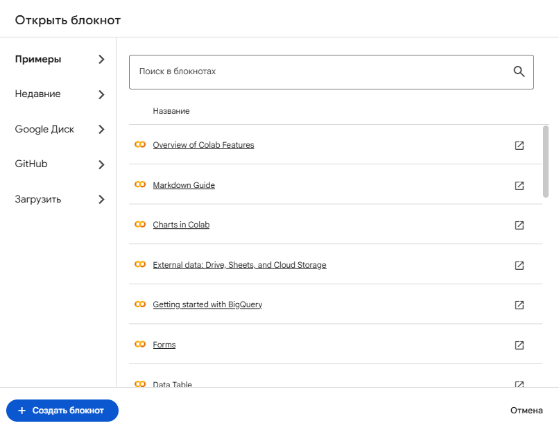
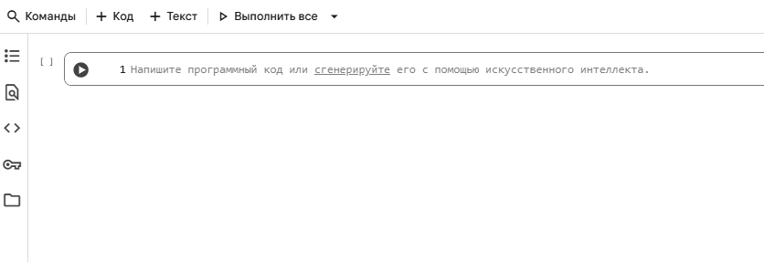
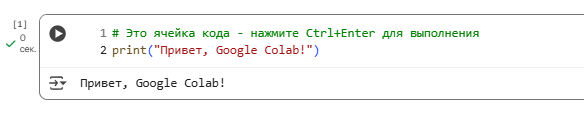
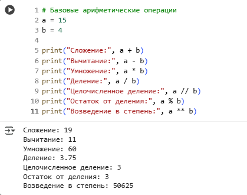
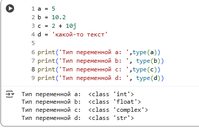
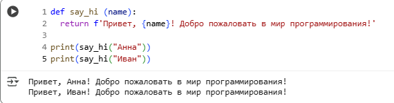
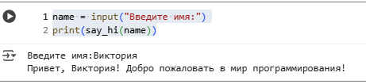
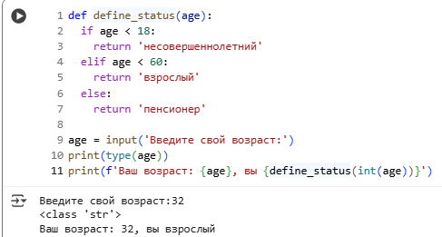
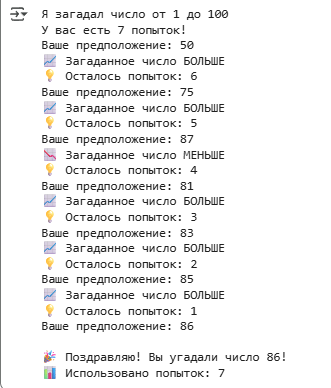

# ПРАКТИЧЕСКАЯ РАБОТА №5. Python в облаке: Первые шаги в Google Colab
🔝 [ Все практические работы](../../README.md)  
🔙 [ Ваш первый веб-сайт: HTML + CSS на GitHub Pages](../PR4/PR4.md)  
🔜  Структуры данных в Python: От списков до словарей
***

## Содержание

🔍 [Теория](#Теория)  
💡 [Полезные ссылки](#Полезные-ссылки)  
⚔️ [Учебная задача](#Учебная-задача)  
📋 [Задания](#Задания)  
🚩 [Контрольные вопросы](#Контрольные-вопросы)

*** 

## Теория

### Введение в Google Colab

**Google Colaboratory (Colab)** — это облачная среда разработки на основе Jupyter Notebook, которая позволяет:

* Работать в браузере без установки дополнительного ПО
 
* Использовать бесплатные вычислительные ресурсы включая GPU и TPU
 
* Совместно работать над проектами
 
* Автоматически сохранять работу в Google Drive

**Преимущества:**

✅ Предустановленные популярные библиотеки

✅ Простота использования для новичков

✅ Доступ с любого устройства

✅ Интеграция с Google Drive

**Типы ячеек:**
* Ячейка кода (`Code cell`) - выполняется как Python код
* Текстовая ячейка (`Markdown cell`) - для оформления текста, формул, описаний

Выполнение кода:
* `Ctrl + Enter` - выполнить ячейку и остаться в ней
 
* `Shift + Enter` - выполнить ячейку и перейти к следующей
 
* `Alt + Enter` - выполнить ячейку и создать новую ниже

### Основные концепции Python

**Переменные** - контейнеры для хранения данных.

**Основные типы данных:**

* **int** - целые числа: `-5, 0, 100`
 
* **float** - дробные числа: `3.14, -2.5, 0.0`
 
* **str** - строки: `"Hello", 'Python'`
 
* **bool** - логические: `True, False`
 
* **list** - списки: `[1, 2, 3, "apple"]`

**Определение функции:**

```python
def function_name(parameters):
    """Docstring - описание функции"""
    # тело функции
    return result
```

**Синтаксис if-elif-else:**

```python
if condition1:
    # выполняется если condition1 True
elif condition2:
    # выполняется если condition2 True
else:
    # выполняется если все условия False
```


Цикл **while** - выполняется пока условие истинно.

Цикл **for** - для перебора элементов.

**Работа с пользовательским вводом (функция `input`)**:
```python
name = input("Введите ваше имя: ")
age = int(input("Введите ваш возраст: "))  # преобразование в число
```
**Импорт модулей:**
```python
import random                    # весь модуль
from math import sqrt, pi       # конкретные функции
import datetime as dt           # псевдоним
```


## Полезные ссылки
1. [Уроки Python (ravesli.com, нужен VPN)](https://ravesli.com/python-tutorial/)
2. [Руководство по языку программирования Python (metanit.com)](https://metanit.com/python/tutorial/)
3. [Самоучитель Python](https://pythonworld.ru/samouchitel-python)


## Учебная задача

Перейдите по ссылке [https://colab.research.google.com/](https://colab.research.google.com/), чтобы попасть в Google Colab. Авторизуйтесь в своей учетке google.  
Создайте новый блокнот:


Есть два типа ячеек:  

* **код** - это непосредственно код на `python`, который можно запустить.
* **текст** - какие-то заметки и/или пояснения в формате `markdown`.

Первая ячейка, которая уже есть в блокноте - это ячейка для кода:


Напишите вот такой код:
```python
# Это ячейка кода - нажмите Ctrl+Enter для выполнения
print("Привет, Google Colab!")
```

И запустите:

> `Ctrl+Enter `(выполнить и остаться) или `Shift+Enter` (выполнить и перейти к следующей ячейке)

Далее создайте еще одну ячейку кода и выполните следующие операции:
```python
# Базовые арифметические операции
a = 15
b = 4

print("Сложение:", a + b)
print("Вычитание:", a - b)
print("Умножение:", a * b)
print("Деление:", a / b)
print("Целочисленное деление:", a // b)
print("Остаток от деления:", a % b)
print("Возведение в степень:", a ** b)
```

> Можно создать **несколько ячеек** и затем **запустить их все разом** (для этого вверху нажмите `Выполнить все`)

В следующей ячейке запустите вот такой код:
```python
# Базовые арифметические операции
a = 15
b = 4

a = 5
b = 10.2
c = 2 + 10j
d = 'какой-то текст'

print('Тип переменной а: ',type(a))
print('Тип переменной b: ', type(b))
print('Тип переменной c: ',type(c))
print('Тип переменной d: ', type(d))
```

> Переменные могут быть **разных типов** и чтобы узнать что именно лежит в переменной используйте функцию `type(имя_переменной)`

Некоторые **фрагменты кода** рекомендуется выделять в **отдельные функции**. Чтобы создать функцию используйте ключевое слово `def`:
```python
def say_hi (name):
  return f'Привет, {name}! Добро пожаловать в мир программирования!'

print(say_hi("Анна"))
print(say_hi("Иван"))
```


> Не забывайте про отступы в нужных местах.

Теперь давайте позволим пользователю самостоятельно вводить имя. Для это используйте функцию `input`:
```python
name = input("Введите имя:")
print(say_hi(name))
```

> Если этот код создаёте **в отдельной ячейке** (*как в примере*), то у вас также должна быть запущена та ячейка, в которой есть функция `say_hi`. Иначе **функция будет не найдена.**

Вот так может выглядеть функция, которая будет возвращать к какой категории относится возраст:

```python
def define_status(age):
  if age < 18:
    return 'несовершеннолетний'
  elif age < 60:
    return 'взрослый'
  else:
    return 'пенсионер'

age = input('Введите свой возраст:')
print(type(age))
print(f'Ваш возраст: {age}, вы {define_status(int(age))}')
```


> Зачем `age` приводить к типу `int` в последней строчке ( `int(age)`)? Что будет, если ввести отрицательное число? А если дробное?

Попробуем реализовать игру: **"Угадай число"**.   

 * Компьютер загадывает число, а игрок должен его угадать за ограниченное количество попыток. 

* Каждый раз когда пользователь вводит число, компьютер подсказывает больше или меньше загаданное число. Например, "загаданное число БОЛЬШЕ", если пользователь ввёл число меньше загаданного.

Эту задачу можно решить вот так:
```python
import random

#настройка диапазона и максимального кол-тва попыток
max_attempts = 7
min_range = 1
max_range = 100

secret_number = random.randint(min_range, max_range)
attempts = 1

print(f"Я загадал число от {min_range} до {max_range}")
print(f"У вас есть {max_attempts} попыток!")

while True:

  guess = int(input("Ваше предположение: "))

  if guess == secret_number:
     print(f"\n🎉 Поздравляю! Вы угадали число {secret_number}!")
     print(f"📊 Использовано попыток: {attempts}")
     break
  elif guess < secret_number:
      print("📈 Загаданное число БОЛЬШЕ")
  else:
      print("📉 Загаданное число МЕНЬШЕ")


  if attempts < max_attempts:
    print(f"💡 Осталось попыток: {max_attempts - attempts}")
    attempts +=1
  else:
    print(f"\n💀 Game Over! Вы исчерпали все попытки.")
    print(f"🔢 Загаданное число было: {secret_number}")
    break
```


Для того, чтобы каждый раз генерировалось случайное число используется модуль `random`

Игра заключается в том, чтобы несколько раз (заранее неизвестно сколько именно раз) делать одно и то же: **спрашивать у пользователя число и сверять его с загаданным.**

Это работа для цикла! Так как заранее неизвестно сколько раз должен выполняться цикл (пользователь может угадать сразу или через 2 попытки, или через 3 и т.д.), то стоит использовать цикл `while`. В данном коде, цикл **бесконечный**. А выходом из цикла являются два условия:  
* либо игрок угадал число.  

* либо закончились попытки.

В каждом из этих случаев используется ключевое слово `break`.

***Какие есть проблемы у этого кода?***

**Главная проблема** в том, что никак не контролируется ввод пользователя. Пользователь может ввести что угодно и это никак не обрабатывается, а значит программа просто вылетит. ***Как это решить?*** Обернуть ввод в `try...except`, например.

**Также** в игру можно сыграть только один раз. Но в условии нет такого требования, так что это не совсем проблема.

С блокнотом учебной задачи можно ознакомиться вот [здесь](https://colab.research.google.com/drive/1-saq8kAPPgqCz2OzPIfqbEUlbKhbYxjm?usp=sharing).
> Чтобы сохранять внесенные в этот блокнот изменения нужно сохранить копию себе на гугл-диск.

## Задания
_Перед выполнением заданий рекомендуется ознакомиться с [учебной задачей](#Учебная-задача)._

### Задание 1. Калькулятор

Напишите простой калькулятор, который:

* последовательно принимает два числа и оператор (+, -, *, /).

* возвращает результат математической операции в зависимости от введенного оператора.

### Задание 2. Генератор паролей

Создайте программу для генерации безопасных паролей.  

Требования:
* Настройка длины пароля.
* Выбор типов символов (буквы, цифры, специальные символы).
* Генерация нескольких паролей сразу.
* Проверка сложности пароля.


## Контрольные вопросы

1. Какие преимущества дает использование Google Colab по сравнению с локальной средой разработки?
2. Какие типы ячеек существуют в Colab и для чего они используются?
3. Как создать и вызвать пользовательскую функцию в Python?
4. Какие основные типы данных вы использовали в работе?
5. Как организовать ввод данных от пользователя в программе?